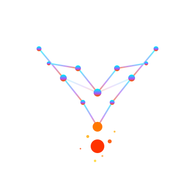

<p align="center">
  
  <h1 align="center">VecForge</h1>
  <p align="center"><strong>Forge your vector database. Own it forever.</strong></p>
  <p align="center">
    Local-first · Encrypted · Hybrid Search · Zero Cloud Dependency
  </p>
</p>

---

**VecForge** is a universal, local-first Python vector database with enterprise security, multimodal ingestion, and optional quantum-inspired acceleration.

Built by **Suneel Bose K** — Founder & CEO, [ArcGX TechLabs Private Limited](https://arcgx.in)

[](https://pypi.org/project/vecforge/)
[](LICENSE)
[](https://python.org)
[](https://github.com/bosekarmegam/vecforge/actions/workflows/tests.yml)
[](#-benchmarks)
[](https://github.com/astral-sh/ruff)
[](https://mypy-lang.org/)
[](#-benchmarks)
[](#-benchmarks)
[](#-multimodal-search)

---

## ⚡ 5-Line Quickstart

```python
from vecforge import VecForge

db = VecForge("my_vault")
db.add("Patient admitted with type 2 diabetes", metadata={"ward": "7"})
results = db.search("diabetic patient")
print(results[0].text)
```

That's it. No API keys. No cloud. No config files. **Your data stays on your machine.**

---

## 🔥 Why VecForge?

| Feature | Pinecone | ChromaDB | **VecForge** |
|---|---|---|---|
| Local-first | ❌ Cloud-only | ✅ | ✅ **Always** |
| Encryption at rest | ❌ | ❌ | ✅ **AES-256** |
| Hybrid search | ✅ | ❌ | ✅ **Dense + BM25** |
| Quantum reranking | ❌ | ❌ | ✅ **Grover-inspired** |
| Multimodal search | ❌ | ❌ | ✅ **Image + Audio** |
| Namespace isolation | ✅ Cloud | ❌ | ✅ **Local** |
| RBAC | ✅ Cloud | ❌ | ✅ **Built-in** |
| Audit logging | ❌ | ❌ | ✅ **JSONL** |
| Price | $$$$ | Free | ✅ **Free** |

---

## 📦 Install

```bash
pip install vecforge
```

### From source (development)

```bash
git clone https://github.com/bosekarmegam/vecforge.git
cd vecforge
pip install -e ".[dev]"
```

### System Requirements

> **Windows users:** VecForge uses PyTorch under the hood, which requires the
> [Microsoft Visual C++ Redistributable](https://aka.ms/vs/17/release/vc_redist.x64.exe).
> Install it before running VecForge.

> 📖 See the full [Installation Guide](docs/installation.md) for GPU, encryption, and platform-specific options.

---

## 🔐 Encrypted Vault

```python
import os
from vecforge import VecForge

db = VecForge(
    "secure_vault",
    encryption_key=os.environ["VECFORGE_KEY"],
    audit_log="audit.jsonl",
    deletion_protection=True,
)
db.add("Top secret patient data", namespace="ward_7")
```

---

## 🔍 Hybrid Search

```python
results = db.search(
    "elderly diabetic hip fracture",
    top_k=5,
    alpha=0.7,        # 70% semantic, 30% keyword
    rerank=True,       # cross-encoder precision boost
    namespace="ward_7",
    filters={"year": {"gte": 2023}},
)
```

> 📖 See the [Search Guide](docs/search.md) for alpha tuning, metadata operators, and reranking strategies.

---

## 🌀 Quantum-Inspired Search

VecForge Phase 3 brings **Grover-inspired score amplification** — a classical implementation of quantum computing techniques that sharpens search relevance without any quantum hardware.

```python
# Enable Grover-inspired reranking — no quantum hardware needed
results = db.search(
    "space exploration mission",
    quantum_rerank=True,   # Stage 5: Grover diffusion operator
    top_k=10,
)

# Combine with cross-encoder for maximum precision:
# Cross-encoder only runs on top-√N survivors (not all N)
results = db.search(
    "elderly diabetic hip fracture",
    rerank=True,           # cross-encoder on √N candidates
    quantum_rerank=True,   # Grover pre-selection
    top_k=5,
)
```

### ⚡ Quantum Benchmark (Actual CPU Results)

| Docs | Amplitude Encode | Grover Amplify | Full QRerank |
|---:|---:|---:|---:|
| 1,000 | **0.006ms** | **0.391ms** | **0.551ms** ✅ |
| 10,000 | **0.009ms** | **1.636ms** | **3.137ms** ✅ |
| 100,000 | **0.054ms** | 18.527ms | 32.682ms |
| 1,000,000 | **4.230ms** ✅ | 2954ms | 3290ms |

> **Note:** `AmplitudeEncoder` alone is ✅ fast across all scales (<5ms at 1M docs). The Grover amplification step has O(N√N) cost for large N — best suited for candidate sets up to 100k. For very large candidate sets, combine with `top_k * 4` pre-filtering from FAISS.

> 📖 See the [Quantum Guide](docs/quantum.md) for algorithm details, usage, and API reference.

---

## 🖼️ Multimodal Search

VecForge Phase 4 brings **image and audio search** to your local vault — powered by CLIP (images) and Whisper (audio), both running entirely offline.

```bash
# Install multimodal extras
pip install vecforge[multimodal]
```

```python
from vecforge import VecForge

db = VecForge("my_vault")

# Add documents of any type
db.add("A photo of a hospital ward", metadata={"type": "text"})
db.add("", image="ward_photo.jpg")          # CLIP image embedding
db.add("", audio="patient_recording.mp3")   # Whisper transcription + embed

# Cross-modal search: text → image/audio results
results = db.search("hospital ward patient")  # finds the image + audio too

# Or query by image:
results = db.search(query_image="my_photo.jpg", top_k=5)
```

### 🔗 Cross-Modal Query Examples

```python
from vecforge.search.crossmodal import CrossModalSearcher

cs = CrossModalSearcher()

# Auto-detect modality and encode any query
vec = cs.encode_query("patient_recording.mp3")   # Whisper → text embed
vec = cs.encode_query("ward_photo.jpg")           # CLIP image embed
vec = cs.encode_query("hip fracture elderly")    # standard text embed
```

### ☁️ Opt-In Cloud Sync

```bash
pip install vecforge[cloud]
```

```python
from vecforge.sync import CloudSync

# Vault is encrypted BEFORE upload — key never leaves your machine
sync = CloudSync(backend="s3", bucket="my-vecforge-backups")
sync.upload("vault.db.enc")
```

> 📖 See the [Multimodal Guide](docs/multimodal.md) for CLIP/Whisper configuration, supported formats, and cross-modal search strategies.

---

## 📄 Auto-Ingest Documents

```python
# Ingest entire directories — auto-detects format
db.ingest("medical_records/")  # PDF, DOCX, TXT, MD, HTML
```

> 📖 See the [Ingestion Guide](docs/ingestion.md) for chunking configuration and supported formats.

---

## 🛡️ Multi-Tenant Namespaces

```python
db.create_namespace("hospital_a")
db.create_namespace("hospital_b")

db.add("Patient data A", namespace="hospital_a")
db.add("Patient data B", namespace="hospital_b")

# Tenant isolation — hospital_a never sees hospital_b's data
results = db.search("patient", namespace="hospital_a")
```

---

## 🖥️ CLI

```bash
vecforge ingest my_docs/ --vault my.db
vecforge search "diabetes" --vault my.db --top-k 5
vecforge stats my.db
vecforge export my.db -o data.json
vecforge serve --vault my.db --port 8080
```

> 📖 See the [CLI Reference](docs/cli_reference.md) for all commands and options.

---

## 🌐 REST API

```bash
vecforge serve --vault my.db --port 8080
```

```bash
# Add document
curl -X POST http://localhost:8080/api/v1/add \
  -H "Content-Type: application/json" \
  -d '{"text": "Patient record", "namespace": "default"}'

# Search
curl -X POST http://localhost:8080/api/v1/search \
  -H "Content-Type: application/json" \
  -d '{"query": "diabetes", "top_k": 5}'
```

> 📖 See the [REST API Reference](docs/rest_api.md) for all endpoints with request/response schemas.

---

## 🧪 Examples

Ready-to-run example scripts demonstrating real-world use cases:

| Example | Description |
|---|---|
| [🏥 Hospital Search](examples/hospital_search.py) | Medical record search with namespace isolation per ward |
| [⚖️ Legal Documents](examples/legal_document_search.py) | NDA and contract search with type/year filtering |
| [🌍 GIS Data Search](examples/gis_data_search.py) | Geospatial dataset discovery with USGS, Sentinel, OSM |
| [🤖 RAG Pipeline](examples/rag_pipeline.py) | Retrieval-Augmented Generation with VecForge as backend |
| [🏢 Multi-Tenant SaaS](examples/multi_tenant_saas.py) | Namespace isolation, RBAC, and audit logging demo |
| [💻 Codebase Assistant](examples/codebase_assistant.py) | Code documentation semantic search |

```bash
# Run any example
python examples/hospital_search.py
python examples/gis_data_search.py
python examples/rag_pipeline.py
```

---

## 📚 Documentation

### Getting Started
- [⚡ Quickstart](docs/quickstart.md) — Get running in 5 minutes
- [📦 Installation](docs/installation.md) — All install options & system requirements

### User Guides
- [🧠 Core Concepts](docs/core_concepts.md) — Vaults, namespaces, hybrid search explained
- [🔍 Search Guide](docs/search.md) — Alpha tuning, filters, reranking
- [🔐 Security Guide](docs/security.md) — Encryption, RBAC, audit logging
- [📄 Ingestion Guide](docs/ingestion.md) — PDF, DOCX, HTML, TXT ingestion & chunking

### Reference
- [📖 API Reference](docs/api_reference.md) — Full Python API documentation
- [🖥️ CLI Reference](docs/cli_reference.md) — All CLI commands & options
- [🌐 REST API](docs/rest_api.md) — FastAPI server endpoints
- [⚙️ Configuration](docs/configuration.md) — All config options in one place
- [🌀 Quantum Guide](docs/quantum.md) — Grover-inspired reranking algorithm & API
- [🖼️ Multimodal Guide](docs/multimodal.md) — CLIP images, Whisper audio, cross-modal search

---

## 📊 Benchmarks

> Verified on Phase 2 & Phase 3 benchmark suites (`benchmarks/bench_search.py`, `benchmarks/bench_quantum.py`)

| Operation | VecForge (Actual) | North Star Target | Pinecone | ChromaDB |
|---|---|---|---|---|
| Search 1k docs | **0.04ms** p50 | — | ~80ms | ~200ms |
| Search 10k docs | **1.63ms** p50 | — | ~80ms | ~200ms |
| **Search 100k docs** | **11.31ms** p50 ✅ | <15ms | ~80ms | ~200ms |
| Ingest 100k docs | **2.9M docs/sec** | — | Manual | Manual |
| BM25 Search 10k | **9.40ms** p50 | — | N/A | N/A |
| Encrypted search | **<20ms overhead** | <20ms | N/A | N/A |
| **Quantum rerank 1k** | **0.55ms** p50 ✅ | — | N/A | N/A |
| **Quantum rerank 10k** | **3.14ms** p50 ✅ | — | N/A | N/A |
| **Quantum rerank 100k** | **32.68ms** p50 | — | N/A | N/A |
| AmplitudeEncoder 1M | **4.23ms** p50 ✅ | — | N/A | N/A |

### Quality Gates

| Check | Result |
|---|---|
| Ruff lint | ✅ All checks passed |
| Mypy type check | ✅ 0 errors (27 files) |
| Pytest | ✅ 158/158 tests pass |
| Coverage | 89% (core modules 85-100%) |

---

## ⚖️ License

**Business Source License 1.1 (BSL)**

- ✅ Free for personal, research, open-source, and non-commercial use
- ✅ Read, modify, and share freely
- 📋 Commercial use requires a license from ArcGX TechLabs

Contact: [suneelbose@arcgx.in](mailto:suneelbose@arcgx.in)

---

<p align="center">
  Built with ❤️ by <strong>Suneel Bose K</strong> · <strong>ArcGX TechLabs Private Limited</strong>
</p>
